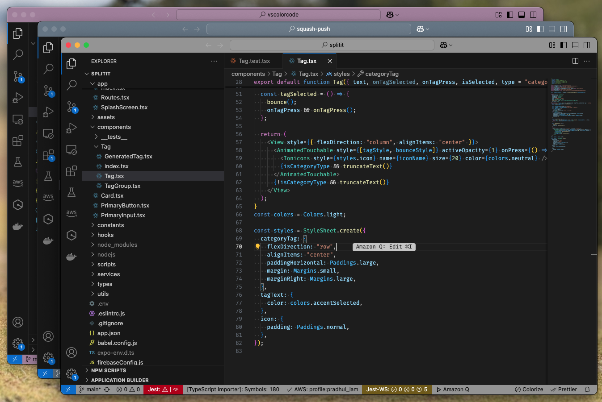

# VS Color Code

A simple VS Code extension that randomly applies muted color themes to your workspace's status bar and title bar. This helps you visually distinguish between different projects or workspaces at a glance.

## Features

- Automatically applies a random muted color theme to your workspace on startup
- Provides a command to change the color theme on demand
- Uses carefully selected color pairs that are easy on the eyes
- Customizes both status bar and title bar for a consistent look

## Usage

1. The extension automatically applies a random color to your workspace when VS Code starts
2. To change the color manually, open the command palette (`Ctrl+Shift+P` or `Cmd+Shift+P` on macOS)
3. Type "Color Code: Apply Random Color" and press Enter

## Commands

This extension contributes the following command:

* `vscolorcode.colorcode`: Apply a random color to the workspace's status bar and title bar

## How It Works

The extension applies a randomly selected color pair from a curated list of muted colors to your workspace's status bar and title bar. The colors are selected to be visually pleasing and easy to distinguish between different projects.

## Release Notes

### 1.0.0

Initial release of VS Color Code:
- Random color application on startup
- Command to change colors on demand
- 10 carefully selected muted color pairs

---

## Contributing

Contributions are welcome! Here are some ways you can contribute:

- Report bugs and feature requests
- Submit pull requests with bug fixes or new features
- Suggest new color pairs that follow the muted theme aesthetic

## License

This extension is licensed under the [MIT License](LICENSE).

**Enjoy your colorful workspaces!**
